# go-redis

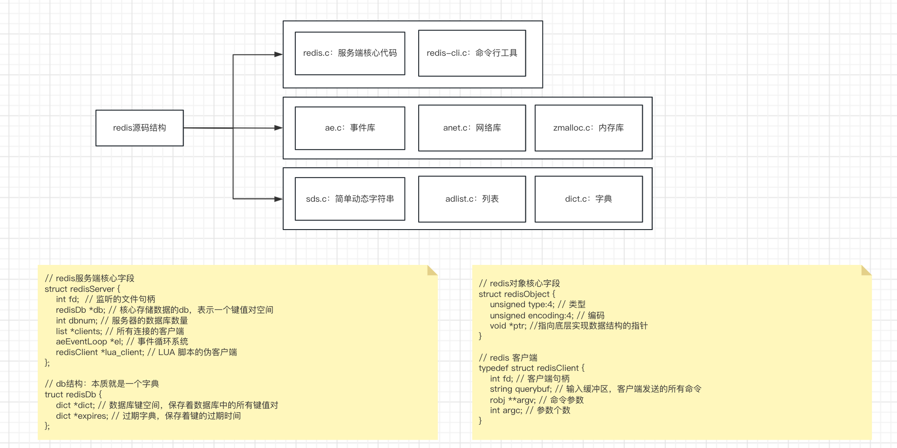

# redis-server 主流程

```c
int main(int argc, char **argv) {
    // ...
    initServerConfig(); // 初始化服务配置
    initServer(); // 初始化服务
    if (aeCreateFileEvent(server.el, server.fd, AE_READABLE, // 创建文件事件监听
        acceptHandler, NULL, NULL) == AE_ERR) oom("creating file event");
    aeMain(server.el); // 启动事件循环
    aeDeleteEventLoop(server.el); // 结束事件循环
    return 0;
}
```

## 服务器初始化

```c
static void initServer() {
    // ...
    server.clients = listCreate(); // 创建客户端列表
    server.el = aeCreateEventLoop(); // 创建事件循环
    server.db = zmalloc(sizeof(redisDb)*server.dbnum); // 内存申请
    server.fd = anetTcpServer(server.neterr, server.port, server.bindaddr); // 端口监听
    for (j = 0; j < server.dbnum; j++) { // 初始化多db
        server.db[j].dict = dictCreate(&hashDictType,NULL);
        server.db[j].expires = dictCreate(&setDictType,NULL);
        server.db[j].id = j;
    }
    aeCreateTimeEvent(server.el, 1000, serverCron, NULL, NULL); // 时间事件循环
    // ...
}
```

## 事件循环

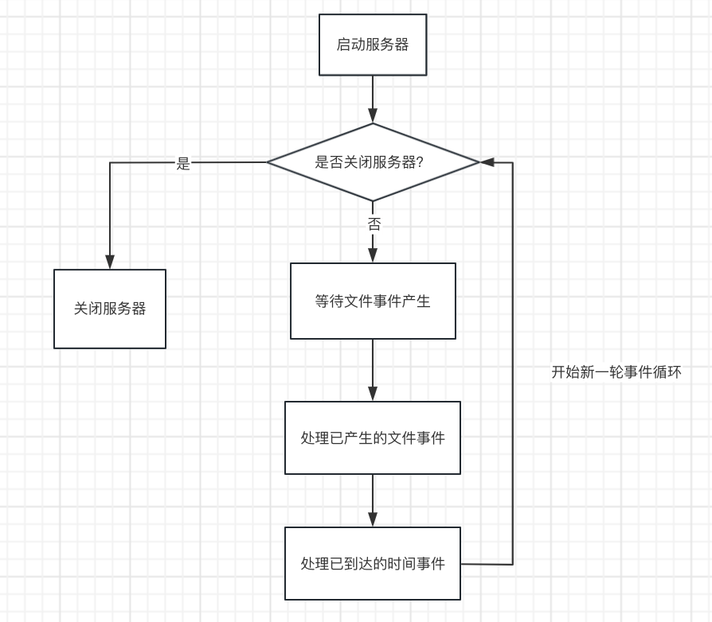

```c
// 处理事件
void aeMain(aeEventLoop *eventLoop)
{
    eventLoop->stop = 0;
    while (!eventLoop->stop)
        aeProcessEvents(eventLoop, AE_ALL_EVENTS);
}
```

## 事件系统

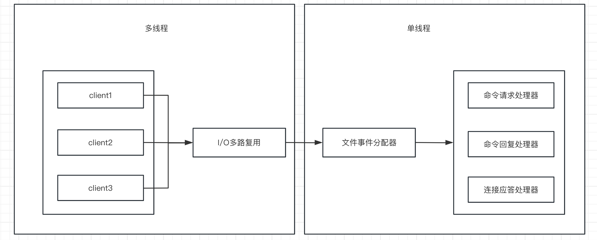

```c
// 文件事件：基于多路复用
typedef struct aeFileEvent {
    int fd; // 客户端连接
    int mask; /* one of AE_(READABLE|WRITABLE|EXCEPTION) */
    aeFileProc *fileProc; // 处理事件回调函数
    aeEventFinalizerProc *finalizerProc;
    void *clientData;
    struct aeFileEvent *next;
} aeFileEvent;

// 时间时间
typedef struct aeTimeEvent {
    long long id; /* time event identifier. */
    long when_sec; /* seconds */
    long when_ms; /* milliseconds */
    aeTimeProc *timeProc; // 处理事件回调函数
    aeEventFinalizerProc *finalizerProc;
    void *clientData;
    struct aeTimeEvent *next;
} aeTimeEvent;

// 事件循环
typedef struct aeEventLoop {
    long long timeEventNextId;
    aeFileEvent *fileEventHead; // 文件事件
    aeTimeEvent *timeEventHead; // 时间事件
    int stop;
} aeEventLoop;
```

# golang 实现简易 redis

## AE 库实现

### 主要流程

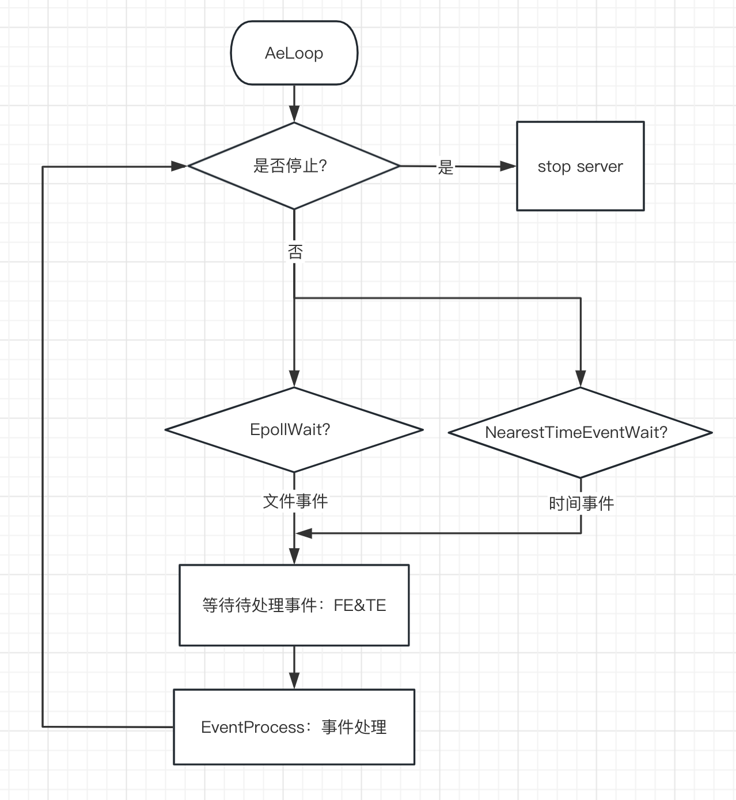

### 文件事件

```go
// 文件事件
type FileType int

const (
	FE_READABLE FileType = 1
	FE_WRITABLE FileType = 2
)

var fileEvent2EpollEvent = map[FileType]uint32{
	FE_READABLE: unix.EPOLLIN,  // 可读事件
	FE_WRITABLE: unix.EPOLLOUT, // 可写事件
}

type FileProc func(loop *AeLoop, fd int, extra interface{})

type AeFileEvent struct {
	fd    int
	mask  FileType
	proc  FileProc
	extra interface{}
}
```

### 时间事件

```go
type TimeType int

const (
	TE_NORMAL TimeType = 1
	TE_ONCE   TimeType = 2
)

type TimeProc func(loop *AeLoop, id int, extra interface{})

type AeTimeEvent struct {
	id       int
	mask     TimeType
	when     int64 // 时间点 ms
	interval int64 // 时间间隔 ms
	proc     TimeProc
	extra    interface{}
	next     *AeTimeEvent
}
```

### 事件循环

```go
type AeLoop struct {
	FileEvents      map[int]*AeFileEvent // 文件事件
	TimeEvents      *AeTimeEvent         // 时间事件
	fileEventFd     int
	timeEventNextId int
	stop            bool
}
```

## 数据结构

### redisObj

```go
type RedisType uint8

const (
	STR  RedisType = 0x00
	LIST RedisType = 0x01
	DICT RedisType = 0x02
)

type RedisVal interface{}

type RedisObj struct {
	Type RedisType
	Val  RedisVal
}
```

### list

```go
type Node struct {
	Val  *RedisObj
	next *Node
	prev *Node
}

type ListType struct {
	EqualFunc func(a, b *RedisObj) bool
}

type List struct {
	ListType
	Head   *Node
	Tail   *Node
	Length int
}
```

### dict

```go
const (
	INIT_SIZE    int64 = 8 // 初始化table大小
	FORCE_RATIO  int64 = 2 // 扩容比率
	GROW_RATIO   int64 = 2 // 扩容倍率
	DEFAULT_STEP int   = 1 // 扩容步数
)

var (
	ErrExpand   = errors.New("expand error")
	ErrExist    = errors.New("key exists error")
	ErrNotExist = errors.New("key doesnt exist error")
)

type Entry struct {
	Key  *RedisObj
	Val  *RedisObj
	next *Entry
}

type htable struct {
	table []*Entry
	size  int64
	mask  int64
	used  int64
}

type DictType struct {
	HashFunc  func(key *RedisObj) int64
	EqualFunc func(k1, k2 *RedisObj) bool
}

type Dict struct {
	DictType
	hts       [2]*htable
	rehashidx int64
}
```

## 命令协议实现

RESP 协议：以第一个字符表示消息的类型，并使用'\r\n'作为消息的分隔符

- "+" 表示一个简单字符串，例如 `+OK\r\n`
- "-" 表示一个错误，例如 `-ERR unknown command\r\n`
- ":" 表示一个整数，例如 `:42\r\n`
- "$" 表示一个二进制安全字符串，例如 `$6\r\nfoobar\r\n`
- "*" 表示一个数组，例如 `*3\r\n$3\r\nfoo\r\n$3\r\nbar\r\n$5\r\nhello\r\n`

比如如下请求

- GET 命令的请求：`*2\r\n$3\r\nGET\r\n$3\r\nfoo\r\n`
- SET 命令的请求：`*3\r\n$3\r\nSET\r\n$3\r\nfoo\r\n$3\r\nbar\r\n`
- GET 命令的响应：`$3\r\nbar\r\n`
- 错误响应：`-ERR unknown command 'xyz'\r\n`
- 整数响应：`:42\r\n`

## redis server 主流程实现

### redis server 核心结构

```go
var server RedisServer

type RedisServer struct {
	fd      int // 服务器监听
	port    int
	db      *redisDB // 键值对空间
	clients map[int]*RedisClient // 所有客户端连接
	aeLoop  *ae.AeLoop // 事件循环
}
```

### 启动流程

```go
// ServerCron server后台任务
func ServerCron(loop *ae.AeLoop, id int, extra interface{}) {
	for i := 0; i < EXPIRE_CHECK_COUNT; i++ {
		entry := server.db.expire.RandomGet() // 随机获取过期键
		if entry == nil {
			break
		}
		if entry.Val.IntVal() < time.Now().Unix() { // 清理过期键
			server.db.data.Delete(entry.Key)
			server.db.expire.Delete(entry.Key)
		}
	}
}

// initServer server初始化
func initServer(config *conf.Config) error {
	server.port = config.Port
	server.clients = make(map[int]*RedisClient)
	server.db = &redisDB{
		data:   obj.DictCreate(obj.DictType{HashFunc: GStrHash, EqualFunc: GStrEqual}), // 键空间
		expire: obj.DictCreate(obj.DictType{HashFunc: GStrHash, EqualFunc: GStrEqual}), // 过期键：清理时机 server后台任务&crud key
	}
	var err error
	server.fd, err = net.TcpServer(server.port) // 启动服务监听
	if err != nil {
		return err
	}
	server.aeLoop, err = ae.AeLoopCreate() // 创建事件循环
	if err != nil {
		return err
	}
	return nil
}
```

## 使用 nc 连接测试

### 客户端连接

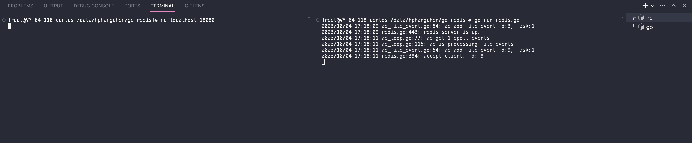

### 错误处理

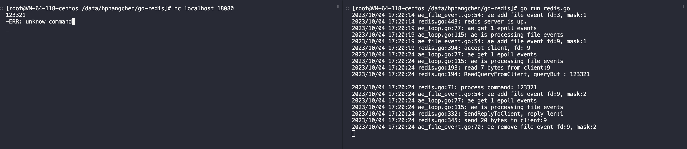

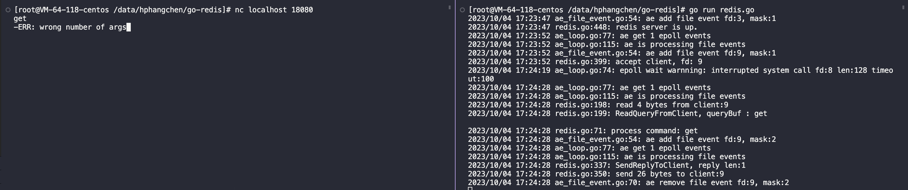

### 创建&查询

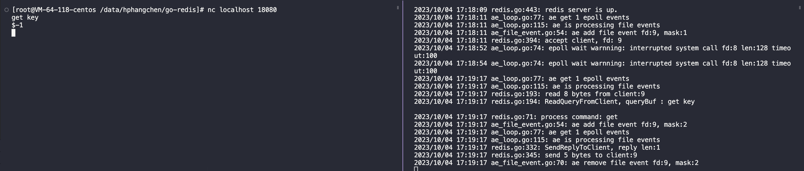

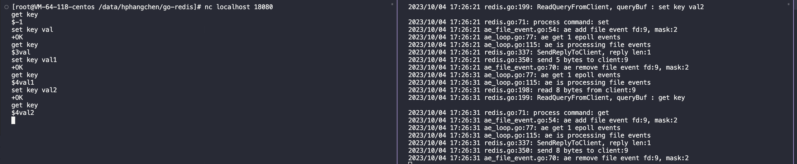

### 支持过期键

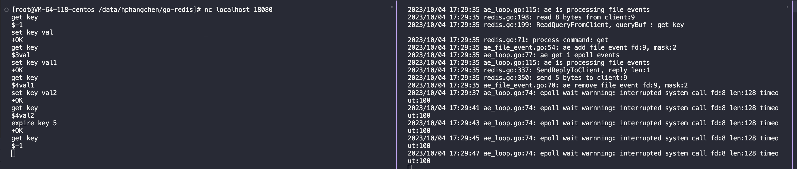

## 支持 http 访问

支持 http：提供基于 socket 的 http 访问

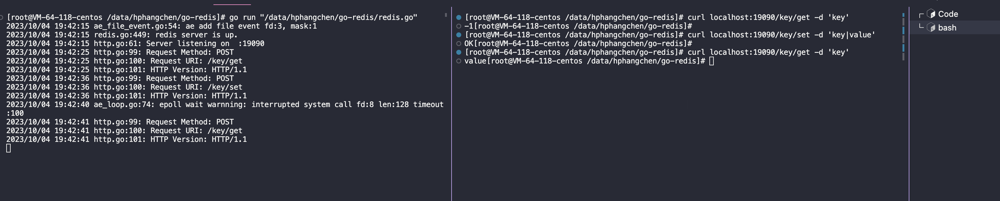
